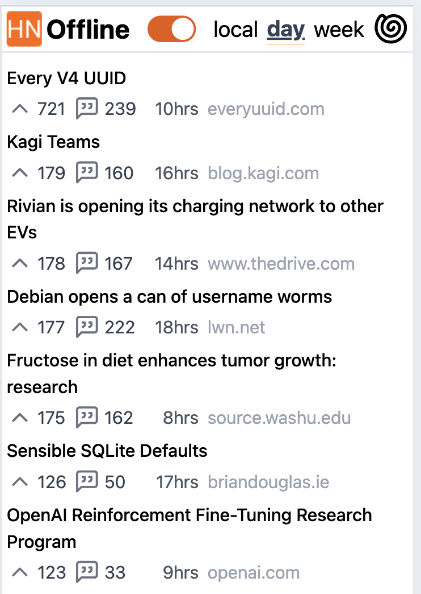
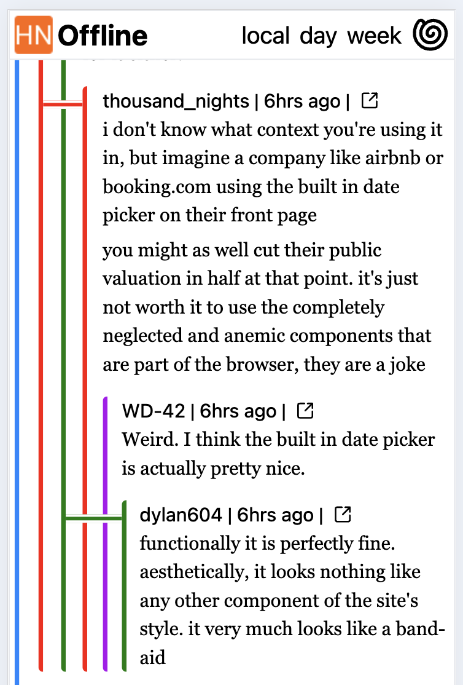
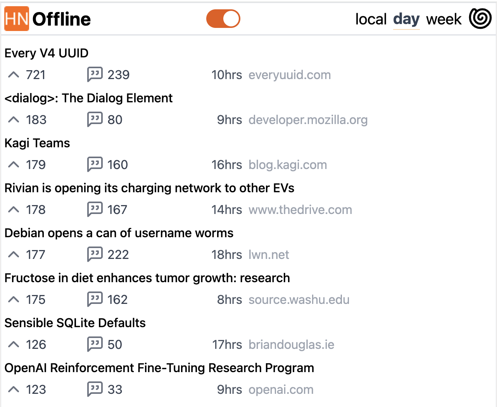
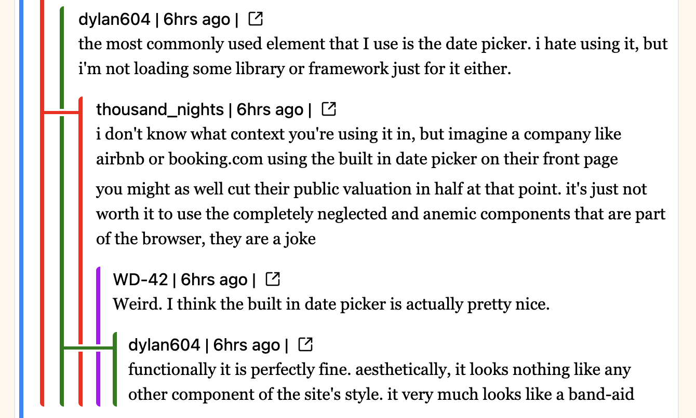

# HN Offline

This is a simple web app to read Hacker News comments by storing a local copy. App uses service workers and local storage to provide fully offline HN reading. The goal of this app is to read the comments. It does not provide an offline version of any articles or non-HN links.

## Screenshots

### Mobile (iPhone SE)

|                               |                               |
| ----------------------------- | ----------------------------- |
|  |  |

### Desktop

|                             |                               |
| --------------------------- | ----------------------------- |
|  |  |

## Features

- Optimized for lurking. No ability to login, comment, or do anything other than read comments and follow links.
- Three main views for accessing stories: front page, day, and week. Each view provides 50 stories. Infinite scroll is intentionally avoided.
  - When loading a list of stories, _all_ comments are loaded for _all_ stories. Experience says loading all 3 pages will require around 15MB of local storage.
- App locally stores HN pages that have been visited to grey them out on the main page.
- No logging, analytics or other tracking on the server.
- Optimized for mobile including `code` blocks which normally look awful.
- Any links to other HN articles are automatically loaded in the app.
- While reading comment threads, a pleasant UX is provided to:
  - Click to collapse a thread and its children. A clickable margin is provided for each parent level on every child.
  - Comment collapse state is stored in local storage.
    - If you leave a story and come back the comments will return to their previous state.
- Colors are randomly assigned to each author.
  - There is logic to minimize collisions within a tree and between nearby comments.
- There is a "subway style" connector to show when comments are replying to each other.
- List of already read stories is saved to local storage.
  - Default view will hide already read stories from lists.

## How It Works

This is a simple web app. Currently built in Remix. There are two APIs which are consumed:

- Official HN API, via Firebase - used to load front page list, story, and comment details
- Algolia HN search results - for the top day and week stories

The server has a simple timer which triggers every 10 minutes to check for updates for the front page. The day and week lists update less frequently. There's additional logic to only reload the comments for a story if enough time has elapsed from the previous update.

The client is a MPA built in React with Remix. The bulk of the code is data management and controlling the view when comments are collapsed.

Built in Typescript.

## Self Host

There is a provider Dockerfile to get things running. I run it on Coolify.

```
docker build -t hn-offline .
docker run -p 3000:3000 hn-offline
```
